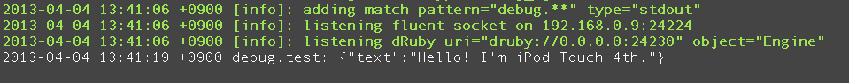

CocoaFluentLogger
=====================

CocoaFluentLogger is currently only supported iOS.

```objc
//#import <CocoaFluentLogger/CocoaFluentLogger.h>
CocoaFluentLogger* logger = [[CocoaFluentLogger alloc] initWithHost:@"fluentd.example.com"
                                                               port:24224 tagPrefix:@"debug"];

[logger connect];

[logger post:@"test"
      object:@{@"text": [NSString stringWithFormat:@"Hello! I'm %@.", [UIDevice currentDevice].name]}];
      
// [logger disConnect];
```



Install
=============

- [CocoaPods: The Objective-C Library Manager](http://cocoapods.org/ "CocoaPods: The Objective-C Library Manager")

```bash
# Add Podfile
# pod 'CocoaFluentLogger', :git => 'https://github.com/laiso/CocoaFluentLogger.git'
    
pod install
```

Acknowledgements
===================

- [Fluentd Project](https://github.com/fluent "Fluentd Project")
- [SocketRocket](https://github.com/square/SocketRocket "SocketRocket")
